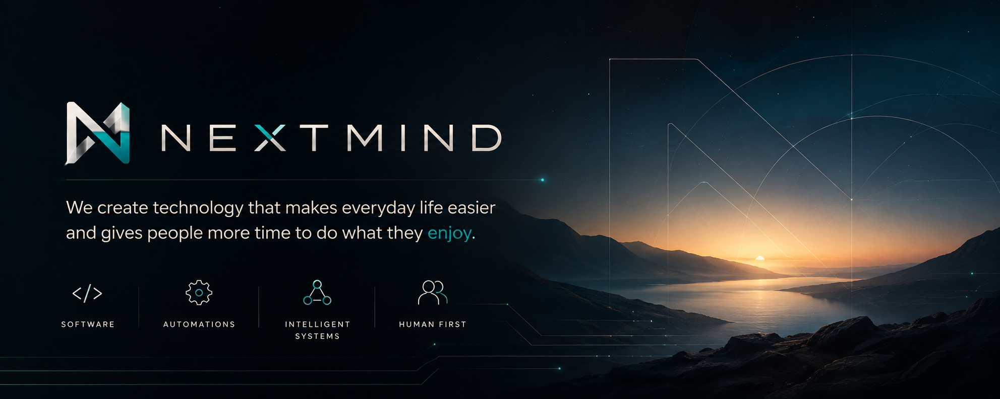

### Technology that gives people more time for what matters.

[Explore NextMind](https://github.com/NextMindHQ/nextmind) · [Website](https://nextmindhq.com) · [GitHub organization](https://github.com/NextMindHQ) · [Contact](mailto:hello.nextmindhq@gmail.com)

 

### What We Are Building

<table>
<tr>
<td width="50%" valign="top">

**[NextMind](https://github.com/NextMindHQ/nextmind)** 
The public front door to NextMind on GitHub: our purpose, product direction, and principles.

</td>
<td width="50%" valign="top">

**[NextMind Business AI](https://nextmindhq.com/#business-ai)** 
Our flagship platform for everyday business automation. **In development.**

</td>
</tr>
</table>

 

---

 

### NextMind Business AI

NextMind Business AI brings specialized AI capabilities and coordinated workflows into one place. It is being developed to reduce repetitive operational work while keeping people in control of important decisions and actions.

Product direction and availability will evolve as we build.

| Area | High-level focus |
|:--|:--|
| **Customer Support** | Common questions, triage, and human handoff |
| **Lead Qualification** | Organizing and routing incoming opportunities |
| **Sales Outreach** | Structured and consistent outreach workflows |
| **CRM** | Useful, current customer and relationship information |
| **Document AI** | Extracting and organizing business information |
| **Proposals and Quotations** | Preparing commercial documents for human review |
| **Fulfillment Handoff** | Moving approved work into delivery |
| **Billing Preparation** | Preparing information for finance workflows |
| **Payment Reconciliation** | Matching payments with the right records |
| **Email Workflows** | Coordinating routine communication with oversight |
| **Appointments and Calendar Workflows** | Supporting scheduling and meeting-related work |
| **Business Integrations** | Connecting workflows with existing business tools |
| **AI-assisted Management** | Creating a clearer view of activity and decisions |

 

---

 

### How We Build

<table>
<tr>
<td width="50%" valign="top">

**Human First** 
Technology should give people time and attention back.

**Production Ready** 
Built for real work, not just demonstrations.

**Modular Systems** 
Focused capabilities that can evolve independently.

**Clear Responsibilities** 
Every part has a purpose people can understand.

</td>
<td width="50%" valign="top">

**Human Control** 
People remain responsible for important decisions.

**Simple by Design** 
The clearest system that solves the problem.

**Long-Term Thinking** 
Foundations intended to remain useful as we grow.

**Honest Progress** 
We share what exists and label what is still being built.

</td>
</tr>
</table>

 

---

 

### Start Here

**[Visit the official NextMind repository →](https://github.com/NextMindHQ/nextmind)**

[nextmindhq.com](https://nextmindhq.com) · [hello.nextmindhq@gmail.com](mailto:hello.nextmindhq@gmail.com)

 

NextMind · Technology for a better life on Earth.

